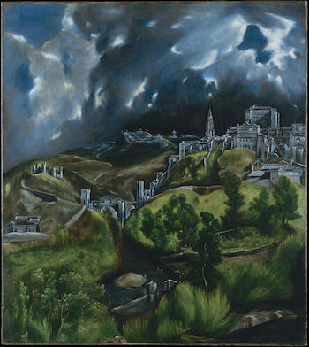

---
output:
  md_document:
    variant: markdown_github
---

<!-- README.md is generated from README.Rmd. Please edit that file -->

```{r, echo = FALSE}
knitr::opts_chunk$set(
  collapse = TRUE,
  comment = "#>",
  fig.path = "figure/",
  fig.height = 1
)
```

# El Greco Palettes



Palettes derived from [El Greco paintings](https://commons.wikimedia.org/wiki/Category:Paintings_by_El_Greco_by_title). I have only included color blind safe palettes. 

## Installation

```r
devtools::install_github("markushlang/elgreco")
```

## Usage

```{r, palettes_dummy}
library("elgreco")
# See all palettes
names(elgreco_palettes)
```

## Palettes

### Andrew and Francis 

```{r}
elgreco_palette("AndrewFrancis1")
```

```{r}
elgreco_palette("AndrewFrancis2")
```

```{r, ggplot1, fig.height = 5, warning = FALSE}
library(ggplot2)

url <- "https://raw.githubusercontent.com/allisonhorst/penguins/master/data/penguins_size.csv"
penguins <- read.csv(url)

ggplot(penguins, aes(flipper_length_mm, body_mass_g, color = species)) +
  geom_jitter(size = 3) +
  scale_color_manual(values = elgreco_palette("AndrewFrancis1")) +
  theme_minimal() +
  labs(title="Penguin size, Palmer Station LTER",
       subtitle="Flipper length and body mass for Adelie, Chinstrap and Gentoo Penguins")
```

### Annunciation

```{r}
elgreco_palette("Annunciation1")
```

```{r}
elgreco_palette("Annunciation2")
```

### Caridad

```{r}
elgreco_palette("Caridad1")
```

```{r}
elgreco_palette("Caridad2")
```

### Disrobing

```{r}
elgreco_palette("Disrobing1")
```

```{r}
elgreco_palette("Disrobing2")
```

### Immaculate

```{r}
elgreco_palette("Immaculate1")
```

```{r}
elgreco_palette("Immaculate2")
```

### Laocoon

```{r}
elgreco_palette("Laocoon1")
```

```{r}
elgreco_palette("Laocoon2")
```

### Marriage

```{r}
elgreco_palette("Marriage1")
```

```{r}
elgreco_palette("Marriage2")
```

### Shepherds

```{r}
elgreco_palette("Shepherds1")
```

```{r, ggplot2, fig.height = 5, warning = FALSE}
ggplot(penguins, aes(x = flipper_length_mm)) +
  geom_histogram(aes(fill = species), 
                 alpha = 0.95, 
                 position = "identity") +
  scale_fill_manual(values = elgreco_palette("Shepherds1")) +
  theme_minimal() +
  labs(x = "Flipper length (mm)",
       y = "Frequency",
       title = "Penguin flipper lengths")
```

### Luke

```{r}
elgreco_palette("Luke1")
```

```{r}
elgreco_palette("Luke2")
```

### Toledo

```{r}
elgreco_palette("Toledo1")
```

```{r}
elgreco_palette("Toledo2")
```

### John

```{r}
elgreco_palette("John1")
```

```{r}
elgreco_palette("John2")
```

## Links 

- This package is inspired by [Karthik Ram's `wesanderson` package](https://github.com/karthik/wesanderson) and [ewen's 'ghibli' package](https://github.com/ewenme/ghibli).

- The penguins dataset used for illustration purposes comes from [Allison Horst](https://github.com/allisonhorst/penguins).

## Citation

[**Gorman KB, Williams TD, Fraser WR** (2014) Ecological Sexual Dimorphism and Environmental Variability within a Community of Antarctic Penguins (Genus *Pygoscelis*). PLoS ONE 9(3): e90081. doi:10.1371/journal.pone.0090081](https://journals.plos.org/plosone/article?id=10.1371/journal.pone.0090081)


