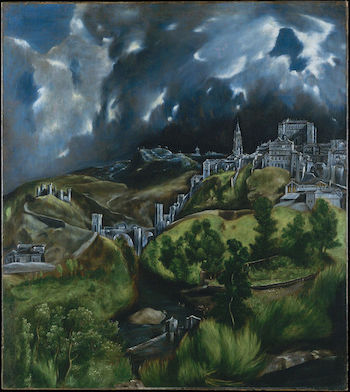
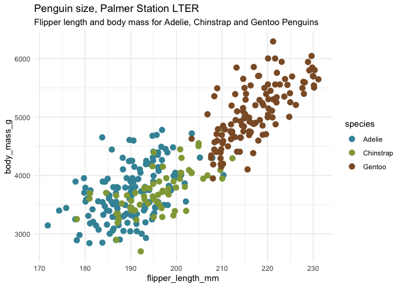
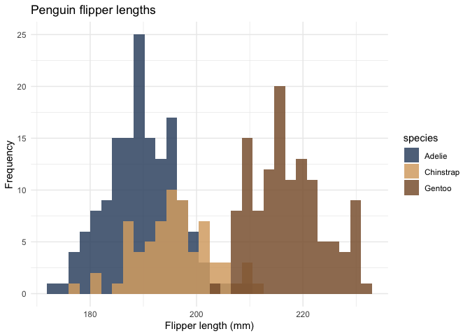

<!-- README.md is generated from README.Rmd. Please edit that file -->
El Greco Palettes
=================



Palettes derived from [El Greco
paintings](https://commons.wikimedia.org/wiki/Category:Paintings_by_El_Greco_by_title).
I have only included color blind safe palettes.

Installation
------------

``` r
devtools::install_github("markushlang/elgreco")
```

Usage
-----

``` r
library("elgreco")
# See all palettes
names(elgreco_palettes)
#>  [1] "AndrewFrancis1" "AndrewFrancis2" "Annunciation1"  "Annunciation2" 
#>  [5] "Caridad1"       "Caridad2"       "Disrobing1"     "Disrobing2"    
#>  [9] "Immaculate1"    "Immaculate2"    "Laocoon1"       "Laocoon2"      
#> [13] "Marriage1"      "Marriage2"      "Shepherds1"     "Luke1"         
#> [17] "Luke2"          "Toledo1"        "Toledo2"        "John1"         
#> [21] "John2"
```

Palettes
--------

### Andrew and Francis

``` r
elgreco_palette("AndrewFrancis1")
```


``` r
elgreco_palette("AndrewFrancis2")
```


``` r
library(ggplot2)

url <- "https://raw.githubusercontent.com/allisonhorst/penguins/master/data/penguins_size.csv"
penguins <- read.csv(url)

ggplot(penguins, aes(flipper_length_mm, body_mass_g, color = species)) +
  geom_jitter(size = 3) +
  scale_color_manual(values = elgreco_palette("AndrewFrancis1")) +
  theme_minimal() +
  labs(title="Penguin size, Palmer Station LTER",
       subtitle="Flipper length and body mass for Adelie, Chinstrap and Gentoo Penguins")
```



### Annunciation

``` r
elgreco_palette("Annunciation1")
```


``` r
elgreco_palette("Annunciation2")
```


### Caridad

``` r
elgreco_palette("Caridad1")
```


``` r
elgreco_palette("Caridad2")
```


### Disrobing

``` r
elgreco_palette("Disrobing1")
```


``` r
elgreco_palette("Disrobing2")
```


### Immaculate

``` r
elgreco_palette("Immaculate1")
```


``` r
elgreco_palette("Immaculate2")
```


### Laocoon

``` r
elgreco_palette("Laocoon1")
```


``` r
elgreco_palette("Laocoon2")
```


### Marriage

``` r
elgreco_palette("Marriage1")
```


``` r
elgreco_palette("Marriage2")
```


### Shepherds

``` r
elgreco_palette("Shepherds1")
```


``` r
ggplot(penguins, aes(x = flipper_length_mm)) +
  geom_histogram(aes(fill = species), 
                 alpha = 0.85, 
                 position = "identity") +
  scale_fill_manual(values = elgreco_palette("Shepherds1")) +
  theme_minimal() +
  labs(x = "Flipper length (mm)",
       y = "Frequency",
       title = "Penguin flipper lengths")
#> `stat_bin()` using `bins = 30`. Pick better value with `binwidth`.
```



### Luke

``` r
elgreco_palette("Luke1")
```


``` r
elgreco_palette("Luke2")
```


### Toledo

``` r
elgreco_palette("Toledo1")
```


``` r
elgreco_palette("Toledo2")
```


### John

``` r
elgreco_palette("John1")
```


``` r
elgreco_palette("John2")
```


Links
-----

-   This package is inspired by [Karthik Ram’s `wesanderson`
    package](https://github.com/karthik/wesanderson) and [ewen’s
    `ghibli` package](https://github.com/ewenme/ghibli).

-   The penguins dataset used for illustration purposes comes from
    [Allison Horst](https://github.com/allisonhorst/penguins).

Citation (Dataset)
------------------

[**Gorman KB, Williams TD, Fraser WR** (2014) Ecological Sexual
Dimorphism and Environmental Variability within a Community of Antarctic
Penguins (Genus *Pygoscelis*). PLoS ONE 9(3): e90081.
doi:10.1371/journal.pone.0090081](https://journals.plos.org/plosone/article?id=10.1371/journal.pone.0090081)
